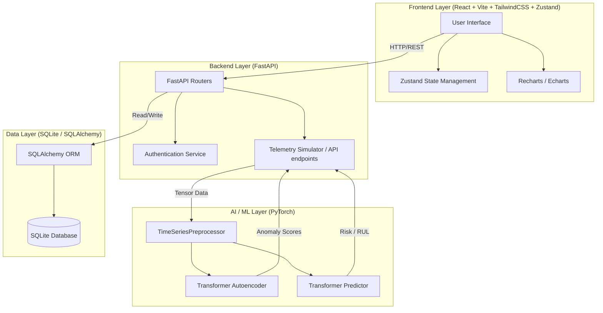
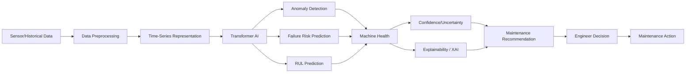
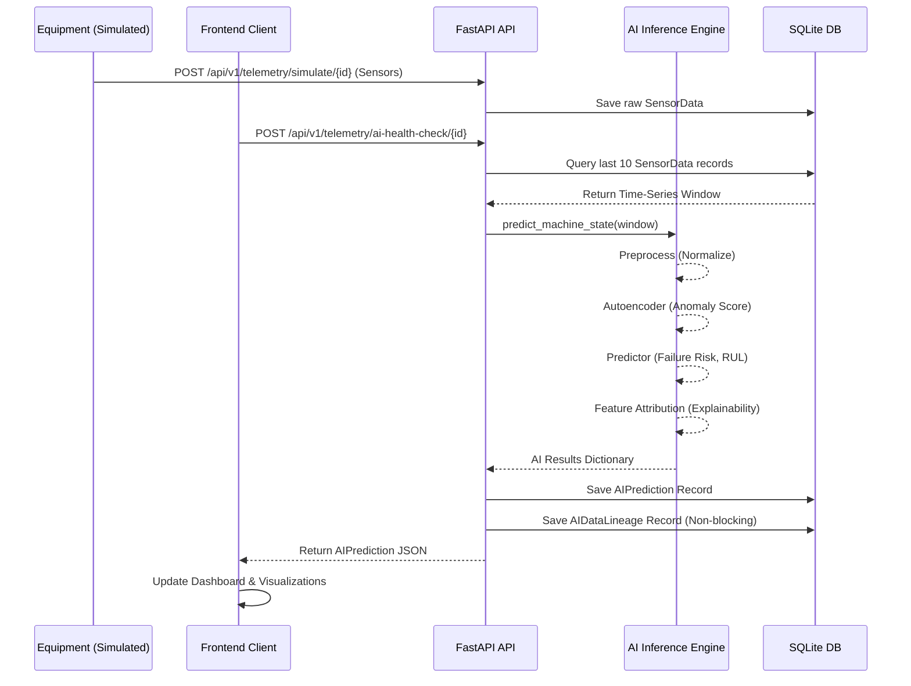
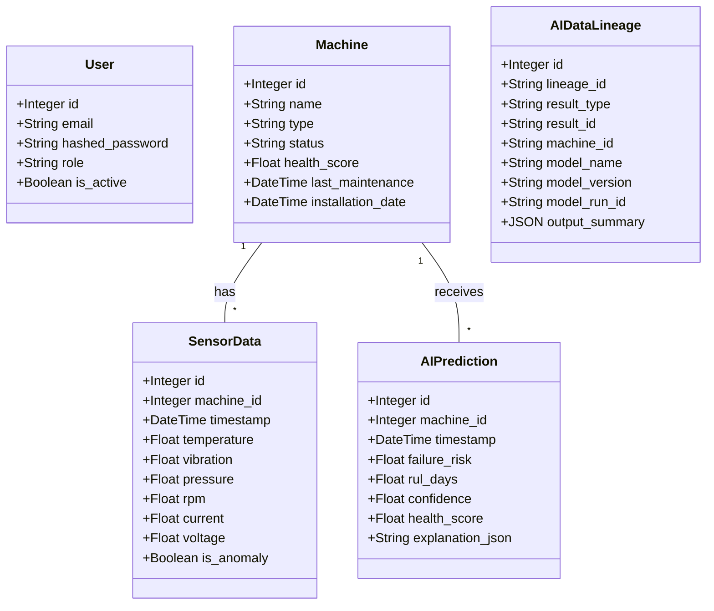
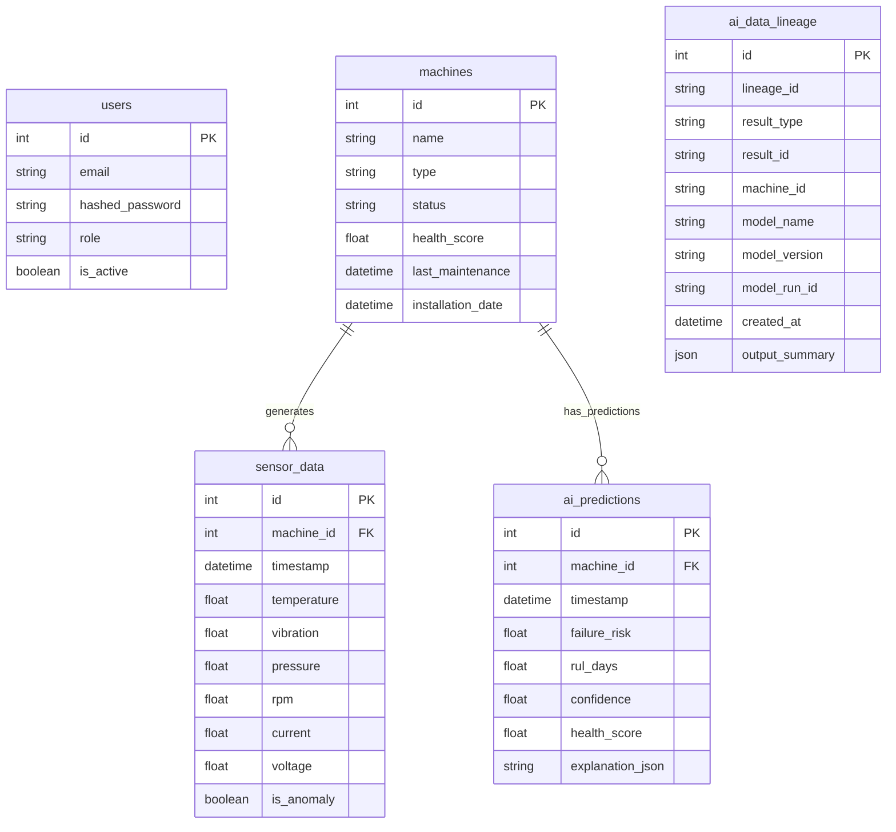

# System Architecture Documentation

This document describes the *actual current implementation* of the AI-powered Smart Equipment Monitoring and Predictive Maintenance system. It supersedes any legacy proposal documentation (which may have referenced KNN, Random Forest, Decision Tree, or SVM algorithms that are not currently used as primary algorithms).

---

## 1. System Architecture Diagram

The system employs a modern, decoupled client-server architecture with an in-memory AI inference engine.



---

## 2. AI Pipeline Architecture

The primary AI pipeline leverages modern deep learning (Transformer architecture) to process time-series data for both anomaly detection and forecasting.



---

## 3. Data Flow Diagram

Illustrates the flow of telemetry data from simulated/real-world ingestion through to the final AI insights presented to the user.



---

## 4. UML Use Case Diagram

```mermaid
usecaseDiagram
    actor "Maintenance Engineer" as Eng
    
    usecase "View Factory Map" as UC1
    usecase "View Live Telemetry" as UC2
    usecase "Trigger AI Health Check" as UC3
    usecase "Run What-If Simulation" as UC4
    usecase "View AI Data Lineage" as UC5
    usecase "Interact with Maintenance Copilot" as UC6
    
    Eng --> UC1
    Eng --> UC2
    Eng --> UC3
    Eng --> UC4
    Eng --> UC5
    Eng --> UC6
```

---

## 5. UML Class Diagram

Shows the primary backend Object-Relational Mapping (ORM) models representing the business logic.



---

## 6. Database / Entity-Relationship (ER) Documentation

The current physical schema maps directly to the SQLAlchemy ORM models on an asynchronous SQLite database.



---

## 7. AI Model Architecture Documentation

The system has transitioned from legacy algorithms to a **Dual-Objective Time-Series Transformer**.

1.  **Input Representation:** Multivariate time-series data with a window size of 10. `[seq_len=10, features=6]` (Temperature, Vibration, Pressure, RPM, Current, Voltage).
2.  **Transformer Autoencoder:** Learns standard representations of healthy machine states. When live data is reconstructed with a high Mean Squared Error (MSE), it flags a real-time `anomaly`.
3.  **Transformer Predictor:** A supervised forecasting head attached to the transformer blocks. It directly predicts continuous outputs for `failure_risk` (probability mapping) and `rul_days` (Remaining Useful Life regression).
4.  **Explainability (XAI):** Feature attribution is currently extracted by analyzing input deviations against normalized baselines, mapping attribution back to specific features to explain *why* the model predicted a failure (e.g., "Vibration: 55% attribution").

---

## 8. Maintenance Workflow Documentation

The UI and API orchestrate a closed-loop workflow:

1.  **Monitor:** User visually tracks machine arrays in `FactoryMap` or `Dashboard`.
2.  **Investigate:** User navigates to `MachineDetails` upon noticing a drop in `health_score`.
3.  **Predict:** User runs "AI Health Check" fetching a live PyTorch inference on the most recent 10 ticks of data.
4.  **Simulate:** If risk is elevated, user runs "What-If Simulation" (e.g., testing if lowering machine load by 20% extends the RUL).
5.  **Audit:** User clicks "View Data Lineage" to verify which model version generated the prediction and what inputs were used.
6.  **Act:** Armed with explainable AI outputs, the engineer safely initiates maintenance protocols.
